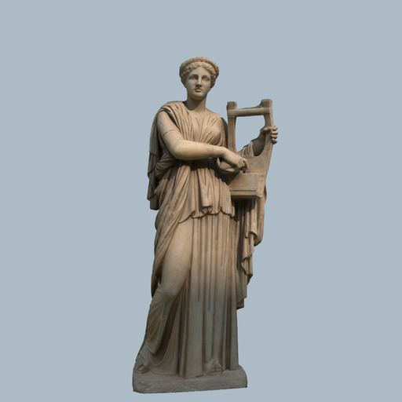
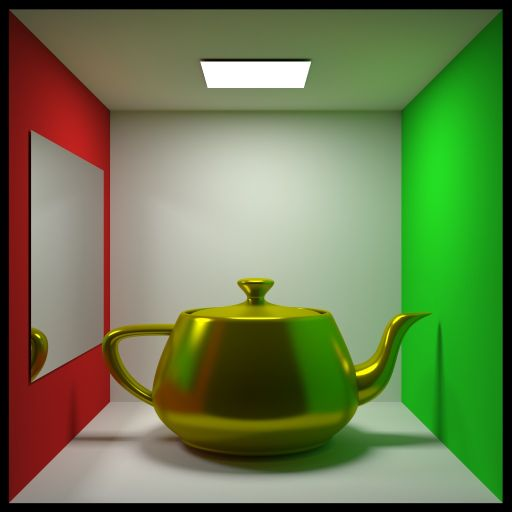
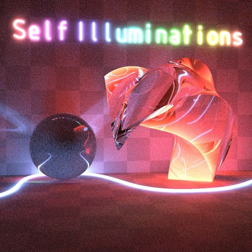

# Scenes
Set of scenes for educational and research purpose in computer graphics applications.

# Table of Contents  <a name="top"/>
- [01_simple_scenes](#01_simple_scenes)
- [02_casual_effects](#02_casual_effects)
- [03_classic_scenes](#03_classic_scenes)
- [04_orca](#04_orca)
- [05_interiors](#05_interiors)
- [06_exteriors](#06_exteriors)
- [07_single_mesh](#07_single_mesh)
- [08](#08)
- [09_orb](#09_orb)

Scenes in this repository are in the in Hydra Renderer XML format ([HydraAPI](https://github.com/Ray-Tracing-Systems/HydraAPI),
[Hydra renderer](http://www.raytracing.ru/)), check sample application which loads scene and renders it with simple
ray tracing renderer using [embree](https://github.com/embree/embree) in [sample_loader_app](sample_loader_app) 
as well as [loader guide](sample_loader_app/README.md).

## Showcase
### [01_simple_scenes](01_simple_scenes) [[back to contents]](#top) <a name="01_simple_scenes"/>
| Model                                                             | Screenshot                                                          | License          |
|-------------------------------------------------------------------|:-------------------------------------------------------------------:|:-----------------|
| [Bunny cornell](01_simple_scenes/bunny_cornell.xml)               |                 | [Stanford scan](https://graphics.stanford.edu/data/3Dscanrep) © 1996 Stanford University |
| [Bunny plane](01_simple_scenes/bunny_plane.xml)                   |                   | [Stanford scan](https://graphics.stanford.edu/data/3Dscanrep) © 1996 Stanford University |
| [Instanced objects](01_simple_scenes/instanced_objects.xml)       |             | [Stanford scan](https://graphics.stanford.edu/data/3Dscanrep) © 1996 Stanford University |

### [02_casual_effects](https://disk.yandex.ru/d/M_qbkejoOYun1Q) [[back to contents]](#top) <a name="02_casual_effects"/>
Converted models from Morgan McGuire's [Computer Graphics Archive](https://casual-effects.com/data).

Actual data is stored in the cloud (Yandex disk) since it is quite large.

| Model                                                                            | Screenshot                                                 | License          |
|----------------------------------------------------------------------------------|:----------------------------------------------------------:|:----------------:|
| [BMW](https://disk.yandex.ru/d/M_qbkejoOYun1Q/bmw)                               |                 | CC0              |
| [Breakfast room](https://disk.yandex.ru/d/M_qbkejoOYun1Q/breakfast_room)         |      | CC BY 3.0 © [Wig42](http://www.blendswap.com/user/Wig42) |
| [Buddha](https://disk.yandex.ru/d/M_qbkejoOYun1Q/buddha)                         |              | [Stanford scan](https://graphics.stanford.edu/data/3Dscanrep) © 1996 Stanford University |
| [Chestnut](https://disk.yandex.ru/d/M_qbkejoOYun1Q/chestnut)                     |            | [Royalty-free](https://blog.turbosquid.com/royalty-free-license/) |
| [Clouds](https://disk.yandex.ru/d/M_qbkejoOYun1Q/clouds)                         |              | CC0              |
| [Conference](https://disk.yandex.ru/d/M_qbkejoOYun1Q/conference)                 |          | Credit required © Anat Grynberg and Greg Ward |
| [Cornell box sphere](https://disk.yandex.ru/d/M_qbkejoOYun1Q/cornell_box_sphere) |  | CC BY 3.0 © 2009 Morgan McGuire |
| [Cornell box water](https://disk.yandex.ru/d/M_qbkejoOYun1Q/cornell_box_water)   |    | CC0 |
| [Crytek Sponza](https://disk.yandex.ru/d/M_qbkejoOYun1Q/crytek_sponza)           |       | CC BY 3.0 © 2010 Frank Meinl, Crytek |
| [Dragon](https://disk.yandex.ru/d/M_qbkejoOYun1Q/dragon)                         |              | [Stanford scan](https://graphics.stanford.edu/data/3Dscanrep) © 1996 Stanford University |
| [Erato](https://disk.yandex.ru/d/M_qbkejoOYun1Q/erato)                           |               | CC BY 4.0 © 2016 [Geoffrey Marchal](https://sketchfab.com/models/4a644dd9390547e0954596d4dd52072b#) |
| [Fireplace room](https://disk.yandex.ru/d/M_qbkejoOYun1Q/fireplace_room)         |      | CC BY 3.0 © [Wig42](http://www.blendswap.com/user/Wig42) |
| [Holodeck](https://disk.yandex.ru/d/M_qbkejoOYun1Q/holodeck)                     |            | CC BY 3.0 © 2016 John William Telford |
| [Indonesian statue](https://disk.yandex.ru/d/M_qbkejoOYun1Q/indonesian_statue)   |          | CC BY-SA 2.5 © 2012 Didier3d |
| [Living room](https://disk.yandex.ru/d/M_qbkejoOYun1Q/living_room)               |         | CC BY 3.0 © 2012 [Jay](http://www.blendswap.com/user/Jay-Artist) |
| [Lost empire](https://disk.yandex.ru/d/M_qbkejoOYun1Q/lost_empire)               |         | CC BY 3.0 © 2011 Morgan McGuire |
| [Lpshead](https://disk.yandex.ru/d/M_qbkejoOYun1Q/lpshead)                       |             | CC BY 3.0 © I-R Entertainment Ltd. |
| [Mitsuba knob](https://disk.yandex.ru/d/M_qbkejoOYun1Q/mitsuba_knob)             |        | [Restricted](http://www.mitsuba-renderer.org/download.html) © Jonas Pilo |
| [Mori knob](https://disk.yandex.ru/d/M_qbkejoOYun1Q/mori_knob)                   |           | CC BY 3.0 © Yasutoshi Mori |
| [Pine](https://disk.yandex.ru/d/M_qbkejoOYun1Q/pine)                             |                | CC0 (Public Domain) |
| [Powerplant](https://disk.yandex.ru/d/M_qbkejoOYun1Q/powerplant)                 |          | [Custom](http://gamma.cs.unc.edu/POWERPLANT/#acknowledgements) © 1999 University of North Carolina |
| [Roadbike](https://disk.yandex.ru/d/M_qbkejoOYun1Q/roadbike)                     |            | CC BY 4.0 © 2015, Yasutoshi Mori |
| [Rungholt](https://disk.yandex.ru/d/M_qbkejoOYun1Q/rungholt)                     |            | CC BY 3.0 © [kescha](http://www.planetminecraft.com/project/neu-rungholt/) |
| [Salle de bain](https://disk.yandex.ru/d/M_qbkejoOYun1Q/salle_de_bain)           |       | CC BY 3.0 © [Nacimus Ait Cherif](http://www.blendswap.com/user/nacimus) |
| [Serapis](https://disk.yandex.ru/d/M_qbkejoOYun1Q/serapis)                       |             | CC BY 2.0 © 2012 MakerBot |
| [Sibenik](https://disk.yandex.ru/d/M_qbkejoOYun1Q/sibenik)                       |             | CC BY-NC © 2002 Marko Dabrovic |
| [Sports car](https://disk.yandex.ru/d/M_qbkejoOYun1Q/sportscar)                  |           | CC BY 4.0 © 2015 Yasutoshi Mori |
| [Vokselia spawn](https://disk.yandex.ru/d/M_qbkejoOYun1Q/vokselia_spawn)         |      | CC BY 3.0 © 2011 Vokselia |
| [White oak](https://disk.yandex.ru/d/M_qbkejoOYun1Q/white_oak)                   |           | CC BY-NC-SA 3.0 © [2017 SpeedTree](https://developer.nvidia.com/orca/speedtree) |

### [03_classic_scenes](https://disk.yandex.ru/d/dDAqgrNeV92_kw) [[back to contents]](#top) <a name="03_classic_scenes"/>
Classic 3d scenes used in computer graphics research.

Actual data is stored in the cloud (Yandex disk) since it is quite large.

| Model                                                                     | Screenshot                                                  | License   |
|---------------------------------------------------------------------------|:-----------------------------------------------------------:|:---------:|
| [Sponza](https://disk.yandex.ru/d/dDAqgrNeV92_kw/01_sponza)               |               | CC BY-NC © 2002 Marko Dabrovic | 
| [Crytek Sponza](https://disk.yandex.ru/d/dDAqgrNeV92_kw/02_cry_sponza)    |            | CC BY 3.0 © 2010 Frank Meinl, Crytek |
| [San Miguel](https://disk.yandex.ru/d/dDAqgrNeV92_kw/03_san_miguel)       |           | CC BY 3.0 © [Guillermo M. Leal Llaguno](http://www.evvisual.com/) |
| [Hairballs](https://disk.yandex.ru/d/dDAqgrNeV92_kw/04_hair_balls)        |            | Hairball model CC BY 3.0 © 2010 NVIDIA Research |

### [04_orca](https://disk.yandex.ru/d/ri_J0wuoZiP34w) [[back to contents]](#top) <a name="04_orca"/>
Scenes from [Open Research Content Archive](https://developer.nvidia.com/orca)

Actual data is stored in the cloud (Yandex disk) since it is quite large.

| Model                                                                                         | Screenshot                                        | License |
|-----------------------------------------------------------------------------------------------|:-------------------------------------------------:|:-------:|
| [Amazon Lumberyard Bistro Exterior](https://disk.yandex.ru/d/ri_J0wuoZiP34w/bistro_exterior)  |      | CC-BY 4.0 © 2017 Amazon Lumberyard |
| [Amazon Lumberyard Bistro Interior](https://disk.yandex.ru/d/ri_J0wuoZiP34w/bistro_interior)  |      | CC-BY 4.0 © 2017 Amazon Lumberyard |
| [UE4 Sun Temple](https://disk.yandex.ru/d/ri_J0wuoZiP34w/suntemple)                           |            | CC BY-NC-SA 4.0 © 2017 Epic Games |

### [05_interiors](https://disk.yandex.ru/d/TqcjyFsrSLelbw) [[back to contents]](#top) <a name="05_interiors"/>
Various interior scenes made for [Hydra render](https://github.com/Ray-Tracing-Systems/HydraCore) 

Actual data is stored in the cloud (Yandex disk) since it is quite large.

| Model                                                                     | Screenshot                                        | License |
|---------------------------------------------------------------------------|:-------------------------------------------------:|:-------:|
| [scene_08](https://disk.yandex.ru/d/TqcjyFsrSLelbw/scene_08)              |        |         |
| [scene_10](https://disk.yandex.ru/d/TqcjyFsrSLelbw/scene_10)              |        | [Custom](https://www.cger.com/site/4741.html) |
| [scene_21](https://disk.yandex.ru/d/TqcjyFsrSLelbw/scene_21)              |        |         |

### 06_exteriors [[back to contents]](#top) <a name="06_exteriors"/>
Various exterior scenes made for [Hydra render](https://github.com/Ray-Tracing-Systems/HydraCore)

### [07_single_mesh](https://disk.yandex.ru/d/RhDT-ty4hi7b_Q) [[back to contents]](#top) <a name="07_single_mesh"/>
Collection of various single mesh scenes

Actual data is stored in the cloud (Yandex disk) since it is quite large.

| Model                                                                     | Screenshot                                        |
|---------------------------------------------------------------------------|:-------------------------------------------------:|
| [asteroid_01](https://disk.yandex.ru/d/RhDT-ty4hi7b_Q)                    |    |
| [asteroid_02](https://disk.yandex.ru/d/RhDT-ty4hi7b_Q)                    |    |
| [asteroid_03](https://disk.yandex.ru/d/RhDT-ty4hi7b_Q)                    |    |
| [asteroid_04](https://disk.yandex.ru/d/RhDT-ty4hi7b_Q)                    |    |
| [asteroid_05](https://disk.yandex.ru/d/RhDT-ty4hi7b_Q)                    |    |
| [starship_01](https://disk.yandex.ru/d/RhDT-ty4hi7b_Q)                    |    |
| [starship_02](https://disk.yandex.ru/d/RhDT-ty4hi7b_Q)                    |    |

### 08 [[back to contents]](#top) <a name="08"/>
REMOVED

### [09_orb](https://disk.yandex.ru/d/n8SzslkmaYHFow) [[back to contents]](#top) <a name="09_orb"/>
Collection of scenes used in [Open Render Benchmark (ORB) paper](https://lppm3.ru/files/journal/XLV/MathMontXLV-Frolov.pdf) (in russian)
Some of the scenes are duplicates from other sections but generally have better tuned materials/light for Hydra renderer.

Actual data is stored in the cloud (Yandex disk) since it is quite large.

| Model                                                                                                       | Screenshot                                                  | License |
|-------------------------------------------------------------------------------------------------------------|:-----------------------------------------------------------:|:-------:|
| [L1.1_cornell_box_hydra](https://disk.yandex.ru/d/n8SzslkmaYHFow/L1.1_cornell_box_hydra)                    |           | CC0 |
| [L1.2_cornell_box_hydra](https://disk.yandex.ru/d/n8SzslkmaYHFow/L1.2_cornell_box_hydra)                    |           | CC0 |
| [L1.3_cornell_box_hydra](https://disk.yandex.ru/d/n8SzslkmaYHFow/L1.3_cornell_box_hydra)                    |           | CC0 |
| [L1.4_Box_Veach_hydra](https://disk.yandex.ru/d/n8SzslkmaYHFow/L1.4_Box_Veach_hydra)                        |             | CC0, based on a scene by Eric Veach |
| [L1.5_caustics_hydra](https://disk.yandex.ru/d/n8SzslkmaYHFow/L1.5_caustics_hydra)                          |              | CC0 |
| [L1.6_glass_box_with_torus_hydra](https://disk.yandex.ru/d/n8SzslkmaYHFow/L1.6_glass_box_with_torus_hydra)  |  | CC0 |
| [L2.2_Cry_Sponza_hydra](https://disk.yandex.ru/d/n8SzslkmaYHFow/L2.2_Cry_Sponza_hydra)                      |            | CC BY 3.0 © 2010 Frank Meinl, Crytek |
| [L2.3_San_Miguel_hydra](https://disk.yandex.ru/d/n8SzslkmaYHFow/L2.3_San_Miguel_hydra)                      |            | CC BY 3.0 © [Guillermo M. Leal Llaguno](http://www.evvisual.com/) |
| [L3.1_Hair_ball_hydra](https://disk.yandex.ru/d/n8SzslkmaYHFow/L3.1_Hair_ball_hydra)                        |             | Hairball model CC BY 3.0 © 2010 NVIDIA Research |
| [L3.2_exterior_hydra](https://disk.yandex.ru/d/n8SzslkmaYHFow/L3.2_exterior_hydra)                          |              |
| [L4.1_statues_hydra](https://disk.yandex.ru/d/n8SzslkmaYHFow/L4.1_statues_hydra)                            |               | Models - CC BY 4.0 © 2016 [Geoffrey Marchal](https://sketchfab.com/models/4a644dd9390547e0954596d4dd52072b#), [Stanford scan](https://graphics.stanford.edu/data/3Dscanrep) © 1996 Stanford University |
| [L5.1_windows_lights](https://disk.yandex.ru/d/n8SzslkmaYHFow/L5.1_windows_lights)                          |              |
| [L6.2_fireplace_hydra](https://disk.yandex.ru/d/n8SzslkmaYHFow/L6.2_fireplace_hydra)                        |             | CC BY 3.0 © [Wig42](http://www.blendswap.com/user/Wig42) |
| [L10.1_Room_Veach_hydra](https://disk.yandex.ru/d/n8SzslkmaYHFow/L10.1_Room_Veach_hydra)                    |           | CC0, based on a scene by Eric Veach |
| [L10.2_glossy_room_hydra](https://disk.yandex.ru/d/n8SzslkmaYHFow/L10.2_glossy_room_hydra)                  |          | CC0, based on a scene by Eric Veach |
| [L10.4_glossy_kitchen_hydra](https://disk.yandex.ru/d/n8SzslkmaYHFow/L10.4_glossy_kitchen_hydra)            |       |
| [L11_selfillum_hydra](https://disk.yandex.ru/d/n8SzslkmaYHFow/L11_selfillum_hydra)                          |              | CC0 |

