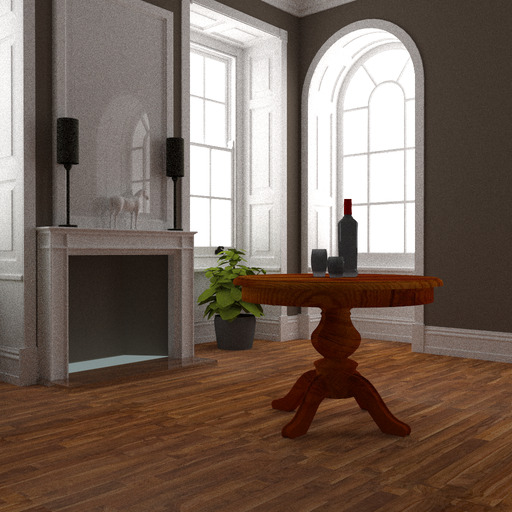
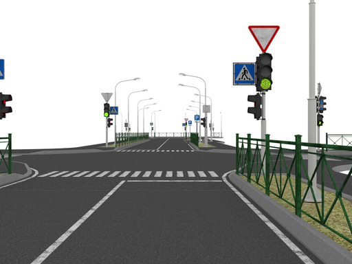

# Scenes
Set of scenes for educational and research purpose in computer graphics applications.

# Table of Contents  <a name="top"/>
- [01_simple_scenes](#01_simple_scenes)
- [02_casual_effects](#02_casual_effects)
- [03_classic_scenes](#03_classic_scenes)
- [04_orca](#04_orca)
- [05_interiors](#05_interiors)
- [06_exteriors](#06_exteriors)
- [07_single_mesh](#07_single_mesh)
- [08_cars_animation](#08_cars_animation)
- [09_orb](#09_orb)

Scenes in this repository are in the in Hydra Renderer XML format ([HydraAPI](https://github.com/Ray-Tracing-Systems/HydraAPI),
[Hydra renderer](http://www.raytracing.ru/)), check sample application which loads scene and renders it with simple
ray tracing renderer using [embree](https://github.com/embree/embree) in [sample_loader_app](sample_loader_app) 
as well as [loader guide](sample_loader_app/README.md).

## Showcase
### [01_simple_scenes](01_simple_scenes) [[back to contents]](#top) <a name="01_simple_scenes"/>
| Model                                                             | Screenshot                                                          |
|-------------------------------------------------------------------|:-------------------------------------------------------------------:|
| [Bunny cornell](01_simple_scenes/bunny_cornell.xml)               |                 |
| [Bunny plane](01_simple_scenes/bunny_plane.xml)                   |                   |
| [Instanced objects](01_simple_scenes/instanced_objects.xml)       |             |

### [02_casual_effects](https://disk.yandex.ru/d/M_qbkejoOYun1Q) [[back to contents]](#top) <a name="02_casual_effects"/>
Converted models from Morgan McGuire's [Computer Graphics Archive](https://casual-effects.com/data).

Actual data is stored in the cloud (Yandex disk) since it is quite large.

| Model                                                                                | Screenshot                                                     |
|--------------------------------------------------------------------------------------|:--------------------------------------------------------------:|
| [BMW](https://disk.yandex.ru/d/M_qbkejoOYun1Q/bmw)                                   |                     |
| [Breakfast room](https://disk.yandex.ru/d/M_qbkejoOYun1Q/breakfast_room)             |          |
| [Buddha](https://disk.yandex.ru/d/M_qbkejoOYun1Q/buddha)                             |                  |
| [Chestnut](https://disk.yandex.ru/d/M_qbkejoOYun1Q/chestnut)                         |                |
| [Clouds](https://disk.yandex.ru/d/M_qbkejoOYun1Q/clouds)                             |                  |
| [Conference](https://disk.yandex.ru/d/M_qbkejoOYun1Q/conference)                     |              |
| [Cornell box sphere](https://disk.yandex.ru/d/M_qbkejoOYun1Q/cornell_box_sphere)     |      |
| [Cornell box water](https://disk.yandex.ru/d/M_qbkejoOYun1Q/cornell_box_water)       |        |
| [Crytek Sponza](https://disk.yandex.ru/d/M_qbkejoOYun1Q/crytek_sponza)               |           |
| [Dragon](https://disk.yandex.ru/d/M_qbkejoOYun1Q/dragon)                             |                  |
| [Erato](https://disk.yandex.ru/d/M_qbkejoOYun1Q/erato)                               |                   |
| [Fireplace room](https://disk.yandex.ru/d/M_qbkejoOYun1Q/fireplace_room)             |          |
| [Holodeck](https://disk.yandex.ru/d/M_qbkejoOYun1Q/holodeck)                         |                |
| [Indonesian statue](https://disk.yandex.ru/d/M_qbkejoOYun1Q/indonesian_statue)       |              |
| [Living room](https://disk.yandex.ru/d/M_qbkejoOYun1Q/living_room)                   |             |
| [Lost empire](https://disk.yandex.ru/d/M_qbkejoOYun1Q/lost_empire)                   |             |
| [Lpshead](https://disk.yandex.ru/d/M_qbkejoOYun1Q/lpshead)                           |                 |
| [Mitsuba knob](https://disk.yandex.ru/d/M_qbkejoOYun1Q/mitsuba_knob)                 |            |
| [Mori knob](https://disk.yandex.ru/d/M_qbkejoOYun1Q/mori_knob)                       |               |
| [Pine](https://disk.yandex.ru/d/M_qbkejoOYun1Q/pine)                                 |                    |
| [Powerplant](https://disk.yandex.ru/d/M_qbkejoOYun1Q/powerplant)                     |              |
| [Roadbike](https://disk.yandex.ru/d/M_qbkejoOYun1Q/roadbike)                         |                |
| [Rungholt](https://disk.yandex.ru/d/M_qbkejoOYun1Q/rungholt)                         |                |
| [Salle de bain](https://disk.yandex.ru/d/M_qbkejoOYun1Q/salle_de_bain)               |           |
| [Serapis](https://disk.yandex.ru/d/M_qbkejoOYun1Q/serapis)                           |                 |
| [Sibenik](https://disk.yandex.ru/d/M_qbkejoOYun1Q/sibenik)                           |                 |
| [Sports car](https://disk.yandex.ru/d/M_qbkejoOYun1Q/sportscar)                      |               |
| [Vokselia spawn](https://disk.yandex.ru/d/M_qbkejoOYun1Q/vokselia_spawn)             |          |
| [White oak](https://disk.yandex.ru/d/M_qbkejoOYun1Q/white_oak)                       |               |

### [03_classic_scenes](https://disk.yandex.ru/d/dDAqgrNeV92_kw) [[back to contents]](#top) <a name="03_classic_scenes"/>
Classic 3d scenes used in computer graphics research.

Actual data is stored in the cloud (Yandex disk) since it is quite large.

| Model                                                                     | Screenshot                                                  |
|---------------------------------------------------------------------------|:-----------------------------------------------------------:|
| [Sponza](https://disk.yandex.ru/d/dDAqgrNeV92_kw/01_sponza)               |               |
| [Crytek Sponza](https://disk.yandex.ru/d/dDAqgrNeV92_kw/02_cry_sponza)    |            |
| [San Miguel](https://disk.yandex.ru/d/dDAqgrNeV92_kw/03_san_miguel)       |           |
| [Hairballs](https://disk.yandex.ru/d/dDAqgrNeV92_kw/04_hair_balls)        |            |

### [04_orca](https://disk.yandex.ru/d/ri_J0wuoZiP34w) [[back to contents]](#top) <a name="04_orca"/>
Scenes from [Open Research Content Archive](https://developer.nvidia.com/orca)

Actual data is stored in the cloud (Yandex disk) since it is quite large.

| Model                                                                                         | Screenshot                                        |
|-----------------------------------------------------------------------------------------------|:-------------------------------------------------:|
| [Amazon Lumberyard Bistro Exterior](https://disk.yandex.ru/d/ri_J0wuoZiP34w/bistro_exterior)  |      |
| [Amazon Lumberyard Bistro Interior](https://disk.yandex.ru/d/ri_J0wuoZiP34w/bistro_interior)  |      |
| [UE4 Sun Temple](https://disk.yandex.ru/d/ri_J0wuoZiP34w/suntemple)                           |            |

### [05_interiors](https://disk.yandex.ru/d/TqcjyFsrSLelbw) [[back to contents]](#top) <a name="05_interiors"/>
Various interior scenes made for [Hydra render](https://github.com/Ray-Tracing-Systems/HydraCore) 

Actual data is stored in the cloud (Yandex disk) since it is quite large.

| Model                                                                     | Screenshot                                        |
|---------------------------------------------------------------------------|:-------------------------------------------------:|
| [scene_08](https://disk.yandex.ru/d/TqcjyFsrSLelbw/scene_08)              |        |
| [scene_10](https://disk.yandex.ru/d/TqcjyFsrSLelbw/scene_10)              |        |
| [scene_21](https://disk.yandex.ru/d/TqcjyFsrSLelbw/scene_21)              |        |

### [06_exteriors](https://disk.yandex.ru/d/MetYef2wCEdiag) [[back to contents]](#top) <a name="06_exteriors"/>
Various exterior scenes made for [Hydra render](https://github.com/Ray-Tracing-Systems/HydraCore)

Actual data is stored in the cloud (Yandex disk) since it is quite large.

| Model                                                                     | Screenshot                                        |
|---------------------------------------------------------------------------|:-------------------------------------------------:|
| [Road scene](https://disk.yandex.ru/d/MetYef2wCEdiag/RoadScenelib)        |      |

### [07_single_mesh](https://disk.yandex.ru/d/RhDT-ty4hi7b_Q) [[back to contents]](#top) <a name="07_single_mesh"/>
Collection of various single mesh scene

Actual data is stored in the cloud (Yandex disk) since it is quite large.

| Model                                                                     | Screenshot                                        |
|---------------------------------------------------------------------------|:-------------------------------------------------:|
| [asteroid_01](https://disk.yandex.ru/d/RhDT-ty4hi7b_Q)                    |    |
| [asteroid_02](https://disk.yandex.ru/d/RhDT-ty4hi7b_Q)                    |    |
| [asteroid_03](https://disk.yandex.ru/d/RhDT-ty4hi7b_Q)                    |    |
| [asteroid_04](https://disk.yandex.ru/d/RhDT-ty4hi7b_Q)                    |    |
| [asteroid_05](https://disk.yandex.ru/d/RhDT-ty4hi7b_Q)                    |    |
| [starship_01](https://disk.yandex.ru/d/RhDT-ty4hi7b_Q)                    |    |
| [starship_02](https://disk.yandex.ru/d/RhDT-ty4hi7b_Q)                    |    |

### [08_cars_animation](https://disk.yandex.ru/d/pV3eVRMZeCXpxg) [[back to contents]](#top) <a name="08_cars_animation"/>
Animation sequences of traffic modeling.
Actual data is stored in the cloud (Yandex disk) since it is quite large.

### [09_orb](https://disk.yandex.ru/d/n8SzslkmaYHFow) [[back to contents]](#top) <a name="09_orb"/>
Collection of scenes used in [Open Render Benchmark (ORB) paper](https://lppm3.ru/files/journal/XLV/MathMontXLV-Frolov.pdf) (in russian)
Some of the scenes are duplicates from other sections but generally have better tuned materials/light for Hydra renderer.

Actual data is stored in the cloud (Yandex disk) since it is quite large.

| Model                                                                                                       | Screenshot                                                  |
|-------------------------------------------------------------------------------------------------------------|:-----------------------------------------------------------:|
| [L1.1_cornell_box_hydra](https://disk.yandex.ru/d/n8SzslkmaYHFow/L1.1_cornell_box_hydra)                    |           |
| [L1.2_cornell_box_hydra](https://disk.yandex.ru/d/n8SzslkmaYHFow/L1.2_cornell_box_hydra)                    |           |
| [L1.3_cornell_box_hydra](https://disk.yandex.ru/d/n8SzslkmaYHFow/L1.3_cornell_box_hydra)                    |           |
| [L1.4_Box_Veach_hydra](https://disk.yandex.ru/d/n8SzslkmaYHFow/L1.4_Box_Veach_hydra)                        |             |
| [L1.5_caustics_hydra](https://disk.yandex.ru/d/n8SzslkmaYHFow/L1.5_caustics_hydra)                          |              |
| [L1.6_glass_box_with_torus_hydra](https://disk.yandex.ru/d/n8SzslkmaYHFow/L1.6_glass_box_with_torus_hydra)  |  |
| [L2.2_Cry_Sponza_hydra](https://disk.yandex.ru/d/n8SzslkmaYHFow/L2.2_Cry_Sponza_hydra)                      |            |
| [L2.3_San_Miguel_hydra](https://disk.yandex.ru/d/n8SzslkmaYHFow/L2.3_San_Miguel_hydra)                      |            |
| [L3.1_Hair_ball_hydra](https://disk.yandex.ru/d/n8SzslkmaYHFow/L3.1_Hair_ball_hydra)                        |             |
| [L3.2_exterior_hydra](https://disk.yandex.ru/d/n8SzslkmaYHFow/L3.2_exterior_hydra)                          |              |
| [L4.1_statues_hydra](https://disk.yandex.ru/d/n8SzslkmaYHFow/L4.1_statues_hydra)                            |               |
| [L5.1_windows_lights](https://disk.yandex.ru/d/n8SzslkmaYHFow/L5.1_windows_lights)                          |              |
| [L6.2_fireplace_hydra](https://disk.yandex.ru/d/n8SzslkmaYHFow/L6.2_fireplace_hydra)                        |             |
| [L10.1_Room_Veach_hydra](https://disk.yandex.ru/d/n8SzslkmaYHFow/L10.1_Room_Veach_hydra)                    |           |
| [L10.2_glossy_room_hydra](https://disk.yandex.ru/d/n8SzslkmaYHFow/L10.2_glossy_room_hydra)                  |          |
| [L10.4_glossy_kitchen_hydra](https://disk.yandex.ru/d/n8SzslkmaYHFow/L10.4_glossy_kitchen_hydra)            |       |
| [L11_selfillum_hydra](https://disk.yandex.ru/d/n8SzslkmaYHFow/L11_selfillum_hydra)                          |              |

